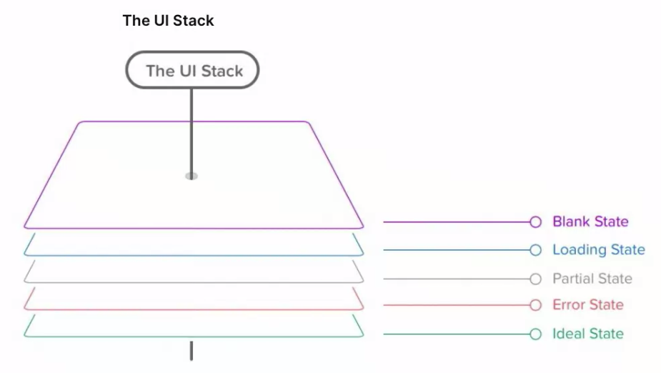

# Designing Dynamic UI States - Notes

## Five UI States

A UI state refers to a particular condition the screen is in at a specific time.

### **Five UI States:**

1. Ideal State
2. Empty State
3. Feedback state
4. Partial State
5. Loading State

### **New terms:**

- _UI state_: A particular condition the screen is in at a specific time.
- _Dynamic UI_: Content changes. Text, images, and data are generated by the system or submitted by the user, and the UI changes based on various conditions.
- _Static UI_: Content stays the same, and the UI stays the same for all users.

---

## Ideal States

The Ideal state is how the UI looks when content perfectly fills the UI, graphs contain data, the user has familiarity with the tool, and the full functionality of the product is apparent.

---

## Empty States

In an Empty state, there is limited content or no content to display in a UI. Also known as a Blank state.

### **New Terms:**

- _Onboarding experience_: The journey of guiding a new user to use a product

### **Resources:**

- **[https://emptystat.es](https://emptystat.es/)** - Empty state inspiration

---

## Feedback States

A Feedback state is shown when the UI informs the user about what's happening in the app.

---

## Partial States

A Partial state is when some data is present. It's in between an Empty State and an Ideal State.

---

## Loading State

The loading state occurs when the UI is receiving content or action is taking place.

### **New terms:**

- _Skeleton screen_: A blank version of a page into which information is gradually loaded.

> It's the five screen states and the seamless transitions between them. Without these transitionary elements, we risk confusing or surprising our customers as new states appear and disappear.

---

## Interactive State

The interactive state is a moment when a user engages with a UI.
