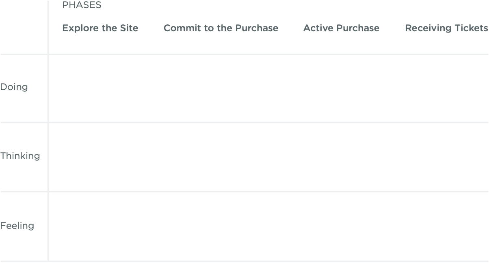
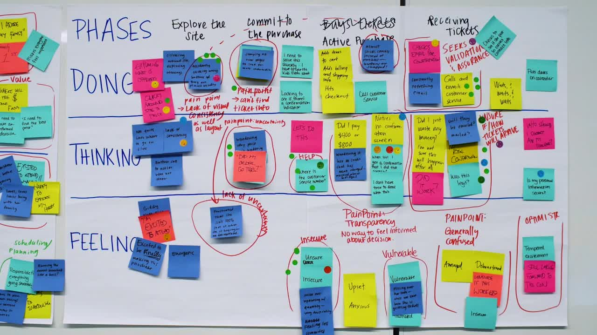

# Notes - Intro to Design Thinking

## Review the terms

- **_Journey map_**: A means of documenting a user's experience from start-to-finish. Journey maps vary from practitioner to practitioner. All journey maps seek to find a user's pain, their motivations, or design opportunities for a user. This may be likened to an empathy map but viewed over the course of an experience rather than a general view of a user during a single point in time.
- **_Pain points_**: Blockers in a user's experience. These may be emotional, technological, process-based, or physical. The severity of pain will vary with each example.
- **_Phases_**: The phases of a journey map are sort of like the chapter titles of a book, except they describe segments of a user experience. Examples from an eCommerce perspective include “browsing” or “payment.”

## Sample result

## Expectations

- **Consistency:** "The button language wasn't clear."
- **Transparency:** "Stable Sarah doesn't know if items were added to her cart."
- **Assurance:** "Stable Sarah needs confirmation of her purchase."
